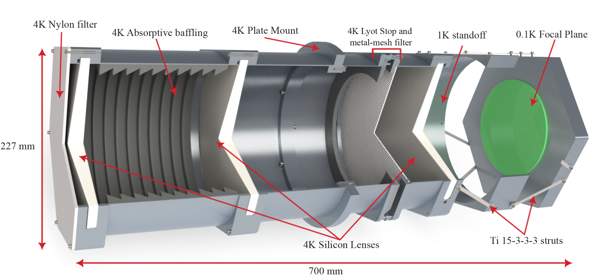
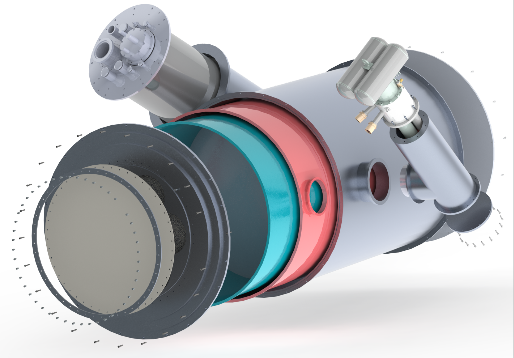
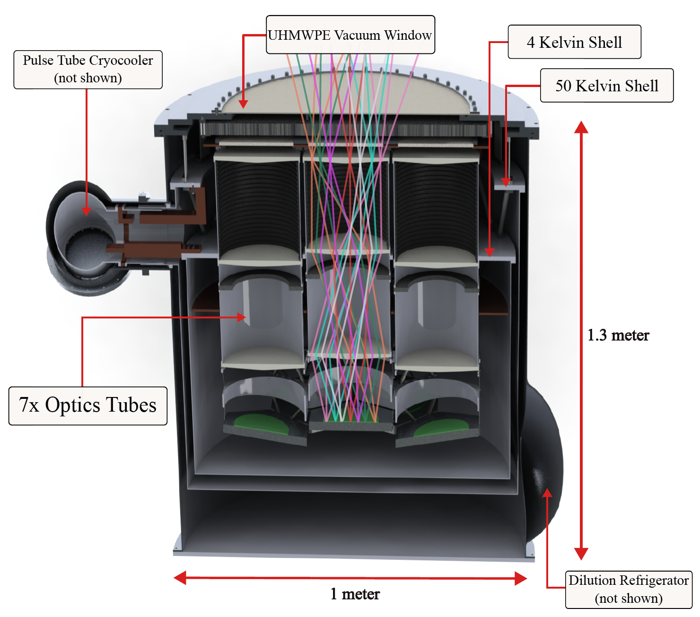

# Summary-of-SPT-4-Cryostat-Design

## My Engineering Analyses:
- [Optics tube design](https://github.com/ahryciuk/SPT-4-Optics-Tube-Design/tree/main)
- [Vacuum window modeling and prototyping](https://github.com/ahryciuk/SPT-4-Vacuum-Window-Prototype)
- [Thermal gradient analysis](https://github.com/ahryciuk/Thermal-Gradient-Analysis-of-SPT-4-Cryostat)
- [Modal analysis of support structures](https://github.com/ahryciuk/Modal-Analysis-of-SPT-4-Cryostat-Support-Structures)
- [Thermal budgeting for selection of cryogenics](https://github.com/ahryciuk/Thermal-Budgeting-of-SPT-4-Cryostat)
  

## Overview of Instrument:

The South Pole Telescope is a 10-meter diameter gregorian design millimeter-wave telescope with numerable scientific motivations within cosmology and astrophyiscs, primarily the study of the Cosmic Microwave Background Radiation (CMB) anisotropies.

  

The SPT-4 (SPT-3G+) Cryostat is a 100 milliKelvin millimeter-wave receiver to be deployed in the Austral summer of 2028-2029, after the tenure of the current SPT-3G receiver. The focal plane is made up of ~34,000 microwave kinetic inductance detectors (MKIDs). I led the integrated design of this instrument, performed engineering analyses to verify design choices, and built a prototype of the vacuum window subassembly. The resultant design is the main subject of my thesis. Below are some figures of some of the important subassemblies. Links to my various engineering analyses are at the top of this page.

SPT-4 Cryostat (quarter cutaway):

  

There are seven individual optics tubes with bandpasses centered at 220 GHz, 280 GHz, and 345 GHz. The tubes are mounted to the 4 Kelvin subassembly so the silicon lenses are cold. I developed custom torsional-spring mounts to provide precision alignment of the lenses and to counteract their cracking due to thermal stress.

  

The sensitive cryogenic environment is maintained by a Bluefors SD250 Dilution refrigerator and a Cryomech PT420 Pulse Tube cryo-cooler. The internals of the cryostat are contained within a set of three nested cylinders heat sunk to progressively lower temperatures (300 Kelvin, 50 Kelvin, and 4 Kelvin). This nested design dramatically limits the radiative heat transfer to the focal plane, allowing the dilution refrigerator to maintain the 100 milliKelvin temperature for the MKID detectors. Care had to be taken in the design of the insulating support structures between these temperature stages to not couple drive frequencies from the telescope observing to the focal plane.

  

An annotated half-cutaway is shown below with the light ray traces overlaid on the central optics tube.

  

